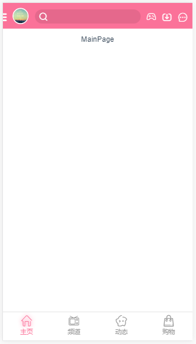
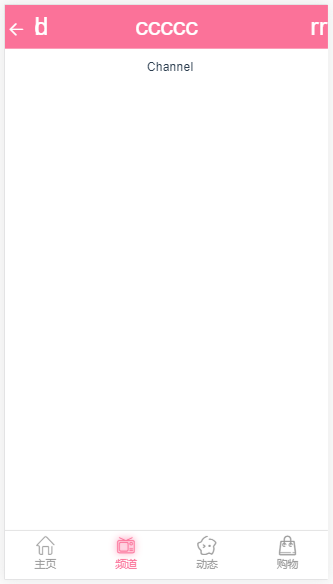
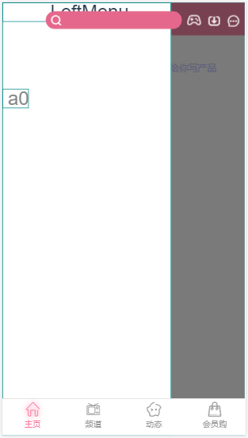
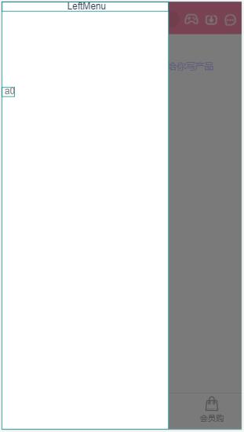

#  Bilebilelike项目
*(2019-04-04 08:30)*  
[预览Bilibililike →](http://thetime50.com/Bilebilelike/)


<!-- 
http://old.wwei.cn/
http://thetime50.com/Bilebilelike
液态 205 15%  
#fc65fc #12d4ff #12d4ff #ffffff
 -->
[test-client →](http://thetime50.com/Bilebilelike/test-client/dist/)

## 说明
用于面试准备的作品，类似bilibili app的vue实现  
项目范围：app整体框架 关键页面 懒加载 模拟数据

API文档：[API Document →](API%20Document.md)  
解析BiliBili API：[bilibili api →](docs\bilibili%20api\bilibili%20api.md)  

**因为有发布dist文件夹 所以static内缺少的文件夹**
**请到对应版本的dist/static下复制**

*(因为赶时间先写项目，文档慢慢写)*

## 项目特点

- 项目自动获取网卡IP能够在局域网访问(虽然对于Secure Origins要求的应用使用localhost会更方便一些)
- mockjs处理登录验证等Ajax数据交互和服务逻辑
- DrawerMap侧滑组件高度还原APP的交互
- RouteScroll路由导航组件同步滑动操作 导航状态 光标 path 支持动态的光标宽度(可能还会加上懒加载)
- 从BiliBili上解析更新数据

可以改进的地方
- 也许会添加摄像头扫码
- 补全功能，添加播放器 弹幕 评论等
- 整理mockjs数据结构和存储方案
- 本地缓存还没做

## 技术选型
- 前台数据交互处理组件化
	- vue全家桶：vue/vue-router/vuex
	- ui组件库：mint-ui
	- 滑动组件：better-scroll
	- 懒加载：vue-lazyload
  - Touch库：vue-touch
  - 剪贴板操作：clipboard
- 前后台交互
	- ajax请求：vue-resource axios
	- mock数据: mockjs
	- 接口测试：postman
- 模块化
	- ES6 //todo
	- bable //todo
- 项目结构化/工程化
	- webpack
	- vuecli
	- eslint //检测语法规范
- css预编译
	- stylus


## 需求分析
### UI需求

1. 主页面(首页)


这里只做框架上的需求分析，子页面和组件的具体需求在实现页面的时候再详细分析

### 业务需求

### 项目素材
截图 安装包里找 网上素材 ICON 自己画

## 执行计划

优先打通业务逻辑vuex ajax mock 以及懒加载和应用滑动库  
包括：
- [ ] 主页面和(顶部和底部菜单 左侧菜单 视频推荐刷新)
- [ ] 登录页面
- [ ] 个人信息页面
- [ ] 侧边栏

## 项目日志
### 2019年4月9日
#### 样式文件引入问题
在.styl文件中引入.css文件使用@import 'xxx.css' 和 @import url('xxx.css')都是可以的，  
但是如果在.styl文件在引入.styl文件只能@import 'xxx.css'，如果加了url会提示Unknown word

在.styl文件中使用相对路径引入.styl文件，则相对路径的当前位置即路径字符串文件所在的目录(就是普通的相对路径)  
在.styl文件中使用相对路径引入.css文件，相对路径的当前位置会变成使用.styl的页面所在目录  
还不知道.styl文件中如何使用绝对路径引入.css，

考虑改用JS选择引入样式文件，而不是使用stylus实现选择引入  
一些辅助工具语法不够严谨，工具嵌套的时候容易出问题(下回试试cass)

#### 静态页面FootGuide显示
用server打开页面能够显示FootGuide  
静态build文件打开页面不显示FootGuide  
有渲染有icon没有显示？？  
1 dom中有FootGuide的元素    
2 css中有element.style{display:none}  
3 得知element.style为js添加的样式(其实原本是内联样式)  
4 FootGuide引用时有 v-show="$route.meta.showFooter"  
5 使用了mode: 'history'选项，静态文件没法路由，所以隐藏了组件  
6 路由屏蔽mode设置改为root#/path的形式，使用分段字符串来路由解决路径问题  

(总算是能够通过思考解决的问题，上回引入.styl的问题花的时间太多了)  
(从前天夜里遇到这个问题今天早晨才解决，找错方向了以为是stylus-loader的问题)  
(而且又着急出项目，卡关了就很绝望)  
(一个很有意思的现象，使用mode: 'history'可以在页面内跳转到root/path,但是直接访问root/path是404)  
(似乎使用路径的形式会产生多次的页面重定向)  

- px 虚拟像素
- em 相对父级对象字体大小
- rem 相对根对象字体大小


现在优先打通业务逻辑vuex ajax mock 以及懒加载和应用滑动库  
包括：
- 主页面和(顶部和底部菜单 左侧菜单 视频推荐刷新)
- 登录页面
- 个人信息页面
- 侧边栏


### 2019年4月10-11日
[插件相关知识](Technology-review.md#vue插件)

解决HeaderTop.vue组件各种问题
1. 插槽元素中央对齐
2. default插槽/left right插槽/center插槽层叠 显示在同一行
3. 动态的元素宽度实现left/right插槽(一直找css的解决方案，最后用js来做)
4. 解决来自根组件等其他地方的样式干扰
5. 解决各种定位问题 box相关问题(position float)

***不知道为著名float会影响父组件里网站的中央对齐***  
*加div都不能消除影响但是用br可以*

实现组件花了一点时间，这两天里20多小时都在调试和布局

元素布局好花时间，需要再找一些，可能使用ui框架会好点

[CSS秘密花园： 环形文本](https://www.w3cplus.com/css3/css-secrets/circular-text.html)  
[5-5 文字编排 -- 圆形文字](https://www.jianshu.com/p/fc69f2ff1e88)  
[神奇的阿基米德螺线](https://blog.csdn.net/github_39335046/article/details/73931821)  
[SVG &ltg>、&ltdefs>、&ltsymbol>和&ltuse>元素详解](http://www.softwhy.com/article-122-1.html)  
[tweenmax](https://www.tweenmax.com.cn)  
[深度掌握SVG路径path的贝塞尔曲线指令](https://www.zhangxinxu.com/wordpress/2014/06/deep-understand-svg-path-bezier-curves-command/)  

 

### 2019年4月12-13日

定位全局用float flex position left/top 加上stylus的计算还是比较好用的  
盒子模型的逻辑太复杂容易出问题只在最小的单元里用，height 100%都容易溢出，还不好定位  
样式不要随便用通配符，不然很容易影响到外面，比如用插槽的时候  
icon太大了加载很慢

添加了游戏页面


面了个试，看了下公司介绍 能动手就不逼逼，看一眼技术要求出门赶紧翻了下neact入门教程。到那是个HR面，对面一直在说我没经验，一说没经验 我就想聊技术，一聊技术对面就没兴趣。咋就不行了 缺哪了说嘛，奇妙的循环，反正过程emmmmm。  
回来路上review了一下，你知道吗日圆大桥上有一边 写的全是日啊

### 2019年4月14-15日
[vue-lazyload插件](https://segmentfault.com/a/1190000012865122)  
[vue-lazyload使用图片路径的坑](https://segmentfault.com/q/1010000009722557)  

> 放在模版里(的图片)是会被 webpack 打包出来，在 js 里写图片路径 webpack 不会处理
你可以把图片放在最外层的 static 文件夹，或者使用 import require 引入：
import logo from './assets/logo.png'  
vue-cli 目录中，只有static 目录放置的静态文件可以被外部访问。如果想在JSON（static/mock/index.json） 中引入图片地址，必须把图片放在static 目录下。然后JSON 中的图片地址，是你的vue 组件引入图片的地址。我是在src/component/home/home.vue中引入 static/img/1.jpg 图片，图片地址为："../../../static/img/1.jpg"。 在JSON 中的地址也要这样写。如果配置JSON 时不确定图片地址，可以在你对应的VUE组件中 直接 引入一张图片测试下地址，然后再放在JSON 中。

js文件中引入图片，不会被webpack进行编译，需要通过import、require引用或将图片放在static下面  
模板中的路径会被webpack解析  

使用会import引入文件以base64的形式引入  
在vue里(loading v-lazy)  
	引入摸版里的文件(src路径下)使用require + 相对路径引用  
	引入根目录下static文件可用require或直接用路引入

[在不同的模块页面设置不同的error图片](https://segmentfault.com/q/1010000014469054)  
```javascript
v-lazy="{src:item.img,loading:require('../images/loading.png'),error:require('../images/error.png')}"
```

~~height @height~~ ×  
height @height  √  
line-height @height  
stylus赛高

- [ ] 解决icon加载问题
- [ ] 路由缓存

- 添加离线缓存页
- 添加search页面
- 消息页面

### 2019年4月16日
css不支持修改光标样式(颜色可以改) 后面考虑Bootstrap

先做主菜单和主页面(主菜单内容就不少)，最后再mock数据把  
脾气一上来啥都想要做，根本来不及啊

忙着处理问题忘记整理图片了

### 2019年4月17日
[基于Vue实现拖拽效果](https://segmentfault.com/a/1190000014572113)  
directives里边不能用this，闭包return fun也不行，好像执行也会比bind慢一点  

[vue-drawer-layout for github](https://github.com/hjl19911127/vue-drawer-layout)

一着急就想上天，啥都要做，然后啥都做不了  
touch和click事件不一样  
bili的左侧菜单其实是一个侧边很窄的区域点击事件，不需要考虑区分滑动方向和拦截事件  
然后加蒙版/动画/位置跟踪就好了 状态恢复??  
打包成组件直接加在header里边，也不用考虑做成插件  
之前考虑太多了。。。

left-menu  
	|- drawer  
	|	|- event process  
	|- menu content  
绑定事件，统一的滑动判断逻辑(用document事件?)(不用 加了蒙版就都覆盖到了)  
长按/滑动-产生摸版
设置scroll标志 (滑出和触碰到菜单时设置)

[移动端，触摸事件 touchstart、touchmove、touchend、touchcancel ](https://www.cnblogs.com/bugong/p/3942988.html)  
[移动端前端常见的触摸相关事件touch、tap、swipe等整理](https://www.cnblogs.com/imwtr/p/5882166.html)  
需要确认移动端click/非click判定和拦截逻辑，存在link时的影响

### 2019年4月20日
vue-touch
better-scroll

### 2019年4月22日
vue-touchjs遇到报错
```
[Intervention] Unable to preventDefault inside passive event listener due to target being treated as passive. See https://www.chromestatus.com/features/5093566007214080
```
vue-touch正常使用

better-scroll  
正常使用

vue-scroller  
默认全屏使用 会比较麻烦感觉

swiper  
全屏捕捉的  
移动端正常使用不知道有没报错  
360网页版正常移模拟动端报错  
chrome网页版正常移模拟动端没报错行为很奇怪
```
[Intervention] Ignored attempt to cancel a touchmove event with cancelable=false, for example because scrolling is in progress and cannot be interrupted.
```
<small>ps:今天断网了 webpack项目IP不对会报错</small><br>
<small>开着服务切wifi直接挂掉电脑重启</small>

### 2019年4月23日
[WEB动画的几种实现方式](https://chuchur.com/article/web-animation)  

1. GIF动画
2. APNG (可能不够标准 Chrome 59之后 IE不支持 http://littlesvr.ca/apng/)
3. Video
4. FLASH动画 / SilverLight (插件)
5. SMIL (只支持IE)
6. JS + HTML
7. *CSS3 transition/animation*
8. *JS + Canvas*
9. *JS + SVG*

```
动画
  |- 交互和布局
  |  |- css
  |  |- ui
  |
  |- 特效
  |  |- AE + Bodymovin/Lottie
  |
  |- 动画制作
  |  |- Spirit
  |
  |- frame
     |- webGL
     |- tree.js
```
《H5 Animatoin》  
《html + javascript 动画基础》

[10 个非常有用的 SVG 动画的 JavaScript 库](https://www.jianshu.com/p/20bfeda0ba3b)  
[推荐15款制作 SVG 动画的 JavaScript 库](https://www.cnblogs.com/i7758/p/5254352.html)  
anime.js  
[有了css3之后，我们还需要canvas还有svg吗？](https://segmentfault.com/q/1010000000459364)

CSS3用于网页渲染  
svg 矢量图 交互 脚本+css 适合大面积少元素  
canvas 大量数据 大量重绘 底层支持 webGL 保存图片

### 2019年4月24-25日
- 滑动弹出
- 长按弹出
- 轻抚展开
- 滑动过半展开
- 轻抚收回
- 滑动过半收回
- 点击蒙版收回

[JS获取子节点、父节点和兄弟节点的若干种方式](https://blog.csdn.net/laok_/article/details/75760572)  
[深入了解canvas在移动端绘制模糊的问题](https://juejin.im/post/5cbdda7bf265da036504fb46) window.devicePixelRatio (dpr) 解决canvas保存图片模糊问题

编辑器提示
```
Argument of type '{ name: string; props: { show: { default: boolean; }; drawerWidth: { type: StringConstructor; default: string; }; mapOpacity: { type: NumberConstructor; default: number; }; mapDisplayWidth: { type: StringConstructor; default: string; }; mapBackgroundColor: { ...; }; pressWidth: { ...; }; time: { ...; }; zIndex: { .....' is not assignable to parameter of type 'new (...args: any[]) => any'.
  Type '{ name: string; props: { show: { default: boolean; }; drawerWidth: { type: StringConstructor; default: string; }; mapOpacity: { type: NumberConstructor; default: number; }; mapDisplayWidth: { type: StringConstructor; default: string; }; mapBackgroundColor: { ...; }; pressWidth: { ...; }; time: { ...; }; zIndex: { .....' provides no match for the signature 'new (...args: any[]): any'.Vetur(2345)
```

- [x] 左侧菜单有触摸卡死现象

### 2019年4月26日
- 左侧菜单卡死是由于flick未处理照成的

- [x] 添加velocity
- [x] 添加threshold
- [x] 修复flick未处理菜单卡死
- [x] 修复菜单闪烁bug
- [x] flick处理
- [x] 修复切换到off时的蒙版效果
- [x] 动画过程中按下暂停

- [ ] 拖拽mapDisplayWidth边缘会触发pancancel导致拖拽失败  
但是pancancel并不是由touchcancel产生的 源码中没有找到对应的代码  
[Dragging An Element With Hammer.Js Fails On Mobile](https://stackanswers.net/questions/dragging-an-element-with-hammer-js-fails-on-mobile)  
确认表现：拖拽覆盖小于触摸半径时会先触发panstart，距离超出半径超出后产生pancancel触摸失败  
之后估计写一个类似的库来替换

- [ ] z-index的行为还是很奇怪，难道要把mask放到footer同一层？



### 2019年4月27日
- [ ] CP端拖动打开菜单会自动关闭  
还有一些其他事件也不太兼容

### 2019年4月28日
- [x] 处理z-index堆叠问题  
[子元素的z-index如何高于父元素的兄弟元素的z-index值](https://segmentfault.com/q/1010000009843297)  
把LeftMenuDrawer反在top里是因为逻辑结构上是这样的  
但是DOM的堆叠规则中堆叠上下文中间是被父元素控制的  
LeftMenuDrawer放在外层，控制显示和绑定数据

- [x] 完成vuex控制LeftMenuDrawer

在HeaderTop.vue中 和菜单按钮同步Drawer-en  
menu中触发action 关闭menu传递src 动画完成回调执行disable和跳转src

还是再考虑一下beforEach触发??



### 2019年4月29日
面了个试，三个问题
1. 响应式布局  
了解过响应式布局的概念但是没有系统的学习过处理方法，布局适应不同客户端的尺寸调整显示效果。  
rem display-grid float之类的也尝试过，获取客户端状态调整布局也不太难，其他更深入的没有了解过  
这个答得不好，对面也不太满意  
  
行吧，还有media
2. webapp  
这不会要回头再看
3. 作品太简单，数据都没有  
就这么多的时间只能做到这样了，边学边做尝试了不同方案，至少遇到的问答题都认真去搞清楚了，  
搞些数据渲染页面什么的还来不及做

没有关系，项目还是继续写，工作还是继续找

---

- bootstrap和响应式布局 +bootstrapvalidator +jNotify
- PhoneGap混合开发
- Ionic webapp
- cordova/Apache Cordova

fastclick??

---

今天还再处理一下左侧菜单组件的问题，然后把菜单lay好

- [x] 左菜单组件使能缓存和更新机制
- [x] 处理动画中点击鼠标没有移动时的抬起事件
- [x] 屏蔽反复触发的click事件

### 2019年5月3日
```stylus
.left-menu-item
  display table
  height 3.5rem
  width 100%
  .item-container
    position relative
    display table-cell
    vertical-align middle
    text-align left
    .item-icon
      display inline-block
      position absolute
      left 1.5rem
      .iconfont
        font-size 1.4rem
    .item-text
      display inline-block
      position absolute
      left 4rem
      font-size 1.1rem

//grid更方便嵌套
//可以在父元素统一控制 也可以在子元素里控制
.left-menu-item
  display grid
  place-items center start
  height 3.5rem
  width 100%
  .item-container
    display grid
    grid-template-columns 4.2rem 1fr
    grid-template-rows 1fr
    justify-items center start
    align-items center
    .item-icon
      .iconfont
        font-size 1.5rem
    .item-text
      font-size 1.1rem
      margin-left 0.8rem
```