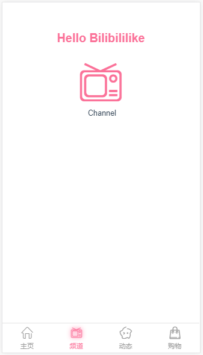

#  Bilebilelike项目
*(2019-04-04 08:30)*  
[预览→](https://thetime50.github.io/Bilebilelike/)

<!-- 
http://www.wwei.cn
https://thetime50.github.io/Bilebilelike
液态 205 15%  
#fc65fc #12d4ff #12d4ff #ffffff
 -->

## 说明
用于面试准备的作品，类似bilibile app的vue实现  
项目范围：app整体框架 关键页面 懒加载 模拟数据

*(因为赶时间先写项目，文档慢慢写)*

## 技术选型
- 前台数据交互处理组件化
	- vue全家桶：vue/vue-router/vuex
	- ui组件库：mint-ui
	- 滑动组件：better-scroll
	- 懒加载：vue-lazyload
- 前后台交互
	- ajax请求：vue-resource axios
	- mock数据:mockjs
	- 接口测试：postman
- 模块化
	- ES6 //todo
	- bable //todo
- 项目结构化/工程化
	- webpack
	- vuecli
	- eslint //检测语法规范
- css预编译
	- stylus

## 需求分析
### UI需求

1. 主页面(首页)

这里只做框架上的需求分析，子页面和组件的具体需求在实现页面的时候再详细分析

### 业务需求

### 项目素材
截图 安装包里找 网上素材 ICON 自己画

## 执行计划

优先打通业务逻辑vuex ajax mock 以及懒加载和应用滑动库  
包括：
- [ ] 主页面和(顶部和底部菜单 左侧菜单 视频推荐刷新)
- [ ] 登录页面
- [ ] 个人信息页面
- [ ] 侧边栏

## 项目日志
### 2019年4月9日
#### 样式文件引入问题
在.styl文件中引入.css文件使用@import 'xxx.css' 和 @import url('xxx.css')都是可以的，  
但是如果在.styl文件在引入.styl文件只能@import 'xxx.css'，如果加了url会提示Unknown word

在.styl文件中使用相对路径引入.styl文件，则相对路径的当前位置即路径字符串文件所在的目录(就是普通的相对路径)  
在.styl文件中使用相对路径引入.css文件，相对路径的当前位置会变成使用.styl的页面所在目录  
还不知道.styl文件中如何使用绝对路径引入.css，

考虑改用JS选择引入样式文件，而不是使用stylus实现选择引入  
一些辅助工具语法不够严谨，工具嵌套的时候容易出问题(下回试试cass)

#### 静态页面FootGuide显示
用server打开页面能够显示FootGuide  
静态build文件打开页面不显示FootGuide  
有渲染有icon没有显示？？  
1 dom中有FootGuide的元素    
2 css中有element.style{display:none}  
3 得知element.style为js添加的样式(其实原本是内联样式)  
4 FootGuide引用时有 v-show="$route.meta.showFooter"  
5 使用了mode: 'history'选项，静态文件没法路由，所以隐藏了组件  
6 路由屏蔽mode设置改为root#/path的形式，使用分段字符串来路由解决路径问题  

(总算是能够通过思考解决的问题，上回引入.styl的问题花的时间太多了)  
(从前天夜里遇到这个问题今天早晨才解决，找错方向了以为是stylus-loader的问题)  
(而且又着急出项目，卡关了就很绝望)  
(一个很有意思的现象，使用mode: 'history'可以在页面内跳转到root/path,但是直接访问root/path是404)  
(似乎使用路径的形式会产生多次的页面重定向)  

- px 虚拟像素
- em 相对父级对象字体大小
- rem 相对根对象字体大小

现在优先打通业务逻辑vuex ajax mock 以及懒加载和应用滑动库  
包括：
- 主页面和(顶部和底部菜单 左侧菜单 视频推荐刷新)
- 登录页面
- 个人信息页面
- 侧边栏

### 2019年4月10-11日
[插件相关知识](Technology-review.md#vue插件)

解决HeaderTop.vue组件各种问题
1. 插槽元素中央对齐
2. default插槽/left right插槽/center插槽层叠 显示在同一行
3. 动态的元素宽度实现left/right插槽(一直找css的解决方案，最后用js来做)
4. 解决来自根组件等其他地方的样式干扰
5. 解决各种定位问题 box相关问题(position float)

***不知道为著名float会影响父组件里网站的中央对齐***  
*加div都不能消除影响但是用br可以*

实现组件花了一点时间，这两天里20多小时都在调试和布局

元素布局好花时间，需要再找一些，可能使用ui框架会好点

[CSS秘密花园： 环形文本](https://www.w3cplus.com/css3/css-secrets/circular-text.html)  
[5-5 文字编排 -- 圆形文字](https://www.jianshu.com/p/fc69f2ff1e88)  
[神奇的阿基米德螺线](https://blog.csdn.net/github_39335046/article/details/73931821)  
[SVG &ltg>、&ltdefs>、&ltsymbol>和&ltuse>元素详解](http://www.softwhy.com/article-122-1.html)  
[tweenmax](https://www.tweenmax.com.cn)  
[深度掌握SVG路径path的贝塞尔曲线指令](https://www.zhangxinxu.com/wordpress/2014/06/deep-understand-svg-path-bezier-curves-command/)  

 